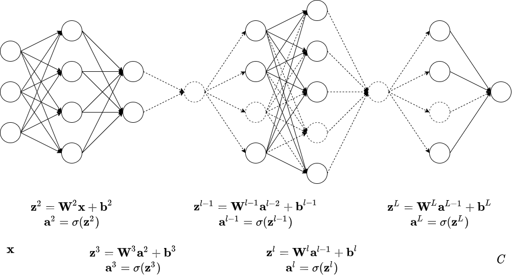

# 神经网络与深度学习

1. 何谓模型？何谓参数？何谓超参数？
2. 为什么要损失函数？能不能直接用正确率？
3. 如何选择损失函数使得学习更快？
4. 学习率越小越好吗？越大越好吗？
5. 正向传播：神经网络模型是怎样进行推理计算的？
6. 反向传播：什么是梯度下降法？在训练过程中是怎样学习的？

### 如何减小损失(_loss_)? 什么是学习率(_learning rate_)?

根据全微分定义，当 $W^l_{jk} \to 0$, $b^l_j \to 0$ 时：

$$\Delta C \to \sum_l\sum_j\left(\sum_k\frac{\partial C}{\partial W^l_{jk}}\Delta W^l_{jk} + \frac{\partial C}{\partial b^l_j}\Delta b^l_j\right)$$

若取 $\Delta W^l_{jk} = -\eta\frac{\partial C}{\partial W^l_{jk}}$, $\Delta b^l_j = -\eta\frac{\partial C}{\partial b^l_j}$, 则有：

$$\begin{aligned} \Delta C &\approx \sum_l\sum_j\left(\sum_k\frac{\partial C}{\partial W^l_{jk}}\Delta W^l_{jk} + \frac{\partial C}{\partial b^l_j}\Delta b^l_j\right)\\ &= -\eta\sum_l\sum_j\left(\sum_k\left(\frac{\partial C}{\partial W^l_{jk}}\right)^2 + \left(\frac{\partial C}{\partial b^l_j}\right)^2\right)\\ &\leqslant 0 \end{aligned}$$

**由此可实现 loss 的递减。** 其中 $\eta$ 是一个很小的正数常量，是一个*超参数*，称为学习率(learning rate).

### 如何求解 $\frac{\partial C}{\partial W^l_{jk}}$ 和 $\frac{\partial C}{\partial b^l_j}$?

**已知 $z^l_j = \sum\limits_kW^l_{jk}a^{l-1}_k + b^l_j$, 选取中间变量 $\delta^l_j \equiv \frac{\partial C}{\partial z^l_j}$, 只要求解 $\delta^l_j$, 即可求解 $\frac{\partial C}{\partial W^l_{jk}}$ 和 $\frac{\partial C}{\partial b^l_j}$, 而 $\delta^l_j$ 是相对好求解的。** 它们的关系如下：

$$\begin{aligned}\frac{\partial C}{W^l_{jk}} &= \frac{\partial C}{\partial z^l_j}\frac{\partial z^l_j}{\partial W^l_{jk}} = \delta^l_j\frac{\partial \left(\sum\limits_kW^l_{jk}a^{l-1}_k + b^l_j\right)}{\partial W^l_{jk}} = \delta^l_ja^{l-1}_k\\\frac{\partial C}{\partial b^l_j} &= \frac{\partial C}{\partial z^l_j}\frac{\partial z^l_j}{\partial b^l_j} = \delta^l_j\frac{\partial \left(\sum\limits_kW^l_{jk}a^{l-1}_k + b^l_j\right)}{\partial b^l_j} = \delta^l_j\end{aligned}$$

写成矩阵的形式：

$$\begin{aligned}\frac{\partial C}{\partial \mathbf W^l} &= \begin{pmatrix}\frac{\partial C}{\partial W^l_{11}} & \frac{\partial C}{\partial W^l_{12}} & \cdots & \frac{\partial C}{\partial W^l_{1k}} \\ \frac{\partial C}{\partial W^l_{21}} & \frac{\partial C}{\partial W^l_{22}} & \cdots & \frac{\partial C}{\partial W^l_{2k}} \\ \vdots & \vdots & \ddots & \vdots \\ \frac{\partial C}{\partial W^l_{j1}} & \frac{\partial C}{\partial W^l_{j2}} & \cdots & \frac{\partial C}{\partial W^l_{jk}}\end{pmatrix} = \begin{pmatrix}\delta^l_1a^{l-1}_1 & \delta^l_1a^{l-1}_2 & \cdots & \delta^l_1a^{l-1}_k \\ \delta^l_2a^{l-1}_1 & \delta^l_2a^{l-1}_2 & \cdots & \delta^l_2a^{l-1}_k \\ \vdots & \vdots & \ddots & \vdots \\ \delta^l_ja^{l-1}_1 & \delta^l_ja^{l-1}_2 & \cdots & \delta^l_ja^{l-1}_k\end{pmatrix} = \boldsymbol \delta^l(\mathbf a^{l-1})^T\\\frac{\partial C}{\partial \mathbf b^l} &= \begin{pmatrix}\frac{\partial C}{\partial b^l_1} \\ \frac{\partial C}{\partial b^l_2} \\ \vdots \\ \frac{\partial C}{\partial b^l_j}\end{pmatrix} = \begin{pmatrix}\delta^l_1 \\ \delta^l_2 \\ \vdots \\ \delta^l_j\end{pmatrix} = \boldsymbol \delta^l\end{aligned}$$

### 接下来如何求解 $\boldsymbol \delta^l$呢？

第一步，先求解 $\boldsymbol \delta^L$; 第二步，找出 $\boldsymbol \delta^{l-1}$ 与 $\boldsymbol \delta^l$ 的关系；最后，根据数学归纳法求出所有 $\boldsymbol \delta^l$.

$\boldsymbol \delta^L$ 是比较好求解的：

$$\boldsymbol \delta^L = (\nabla \mathbf a^L)^T\frac{\partial C}{\partial \mathbf a^L}$$

> 常见的几种 $\mathbf a^L$ - $C$ 组合及其 $\boldsymbol \delta^L$:
>
> |                             Output function                             |                                   Loss function                                    | $\boldsymbol \delta^L = (\nabla \mathbf a^L)^T\frac{\partial C}{\partial \mathbf a^L}$ |
> | :---------------------------------------------------------------------: | :--------------------------------------------------------------------------------: | :------------------------------------------------------------------------------------: |
> |                   Linear: $\mathbf a^L = \mathbf z^L$                   |                   MSE: $C=\frac{(\mathbf a^L - \mathbf y)^2}{2}$                   |                    $\boldsymbol \delta^L = \mathbf a^L - \mathbf y$                    |
> |         Sigmoid: $\mathbf a^L = \frac{1}{1 + e^{-\mathbf z^L}}$         | CrossEntropy: $C=-[\mathbf y\ln\mathbf a^L + (1 - \mathbf y)\ln(1 - \mathbf a^L)]$ |                    $\boldsymbol \delta^L = \mathbf a^L - \mathbf y$                    |
> | Softmax: $\mathbf a^L = \frac{e^{\mathbf z^L}}{\sum\limits_ie^{z^L_i}}$ |                 LogLikelihood: $C = -\ln a^L_{\argmax \mathbf y}$                  |                    $\boldsymbol \delta^L = \mathbf a^L - \mathbf y$                    |

而 $\boldsymbol \delta^{l-1}$ 与 $\boldsymbol \delta^l$ 的关系也不难发现：

$$\delta^{l-1}_k = \frac{\partial C}{\partial z^{l-1}_k} = \sum_j\frac{\partial C}{\partial z^l_j}\frac{\partial z^l_j}{\partial a^{l-1}_k}\frac{\partial a^{l-1}_k}{\partial z^{l-1}_k} = \sum_j\delta^l_j\frac{\partial\left(\sum\limits_kW^l_{jk}a^{l-1}_k + b^l_j\right)}{\partial a^{l-1}_k}\frac{\partial a^{l-1}_k}{\partial z^{l-1}_k} = \sum_j\delta^l_jW^j_{jk}\nabla z^{l-1}_k = \sum_jW^j_{jk}\delta^l_j\nabla z^{l-1}_k$$

写成矩阵的形式：

$$\boldsymbol\delta^{l-1} = \begin{pmatrix}\delta^{l-1}_1\\\delta^{l-1}_2\\\vdots\\\delta^{l-1}_k\end{pmatrix} = \begin{pmatrix}\sum\limits_jW^j_{j1}\delta^l_j\nabla z^{l-1}_1\\\sum\limits_jW^j_{j2}\delta^l_j\nabla z^{l-1}_2\\\vdots\\\sum\limits_jW^j_{jk}\delta^l_j\nabla z^{l-1}_k\end{pmatrix} = (\mathbf W^l)^T\boldsymbol\delta^l\odot\nabla\mathbf z^{l-1}$$

总结一下，可得反向传播(Backpropagation)的更新流程：

$$
\begin{alignedat}{6}
&\boldsymbol\delta^L &=&& (\nabla\mathbf a^L)^T\frac{\partial C}{\partial\mathbf a^L}&\quad&\quad
&\boldsymbol\delta^{l-1} &=&& (\mathbf W^l)^T\boldsymbol\delta^l\odot\nabla\mathbf z^{l-1}&\\
&\frac{\partial C}{\partial\mathbf W^l} &=&& \boldsymbol\delta^l(\mathbf a^{l-1})^T&\quad&\quad
&\frac{\partial C}{\partial\mathbf b^l} &=&& \boldsymbol\delta^l&\\
&\mathbf W^l &\gets&& \mathbf W^l - \eta\frac{\partial C}{\partial\mathbf W^l}&\quad&\quad
&\mathbf b^l &\gets&& \mathbf b^l - \eta\frac{\partial C}{\partial\mathbf b^l}&
\end{alignedat}
$$

### Sigmoid + MSE 有什么不好？

一个聪明的人，犯的错误越大，长的教训就越大；一个好的神经网络也要一样，损失越大学习越快。**而 Sigmoid + MSE 却是损失越大学习越慢**，所以它们不是一组好的组合。

> 如果 Output function 为 $a_i^L = \frac{1}{1 + e^{-z_i^L}}$, Loss function 为 $C = \frac{(a_i^L - y_i^L)^2}{2}$, 则：
>
> $$\delta_i^L = \frac{\partial C}{\partial z_i^L} = \frac{\partial C}{\partial a_i^L}\frac{\partial a_i^L}{\partial z_i^L} = (a_i^L - y_i^L)a_i^L(1 - a_i^L)$$
>
> 由此可知，$a_i^L \to 0$ 或 $a_i^L \to 1$ 时，$\delta_i^L \to 0$, 也就是损失越大学习越慢。
